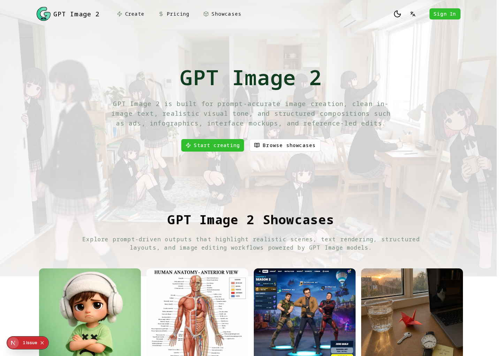
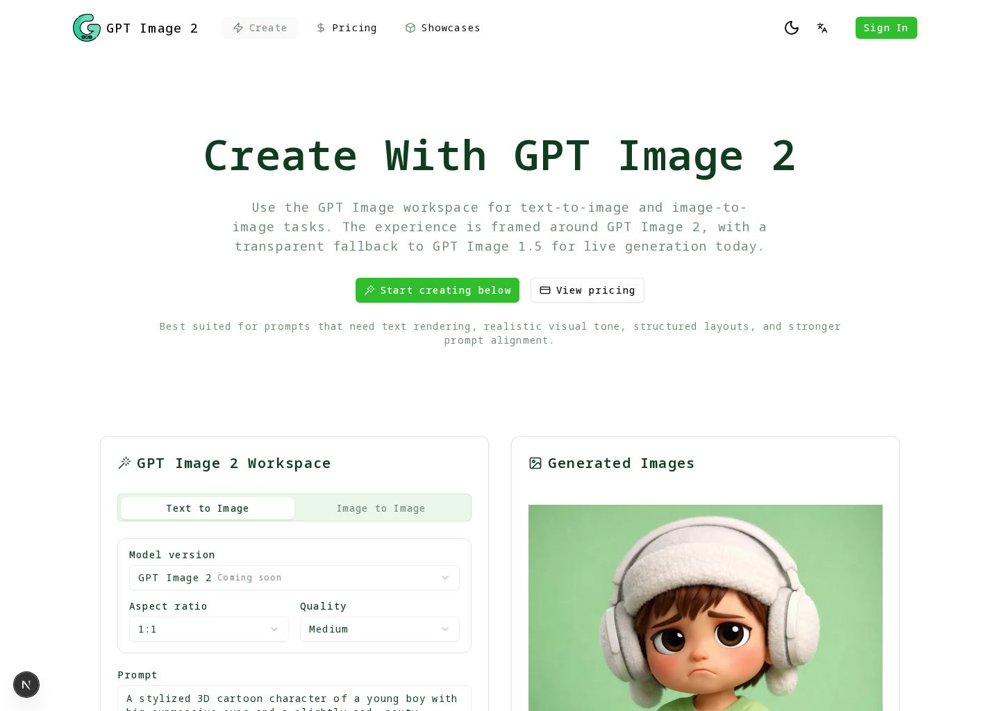
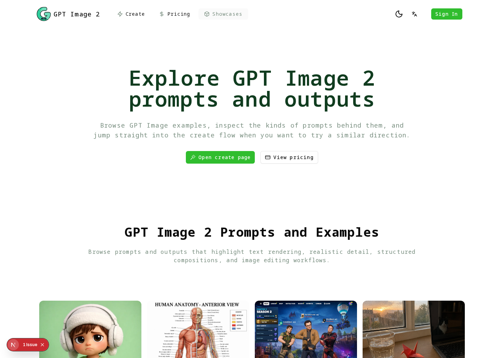

  

# GPT Image 2

Official public repository for [GPT Image 2 AI image generator and editor](https://gptimage2.top). GPT Image 2 is a focused image generation and reference-image editing workspace for prompts, showcases, structured visuals, and repeat creative production.

This repository is the public home for product feedback, issue reports, roadmap notes, support guidance, and community discussion. It does not contain the private production source code for the live website.

## Product Preview

| Create workspace | Showcases |
| --- | --- |
|  |  |

## Product Focus

- Creators generating prompt-based visuals for covers, posters, ads, and product pages
- Marketing teams producing campaign images and structured graphics
- Designers exploring UI-like compositions, labels, cards, and infographics
- Users who need reference-image editing instead of text-only generation

## Main Workflows

- Generate images from text prompts for covers, ads, product visuals, and structured drafts.
- Upload reference images and guide edits with prompts.
- Browse showcases before creating instead of starting from a blank prompt.
- Choose 1K, 2K, or 4K output based on task needs and credit cost.
- Continue repeat production through credits, monthly plans, or annual plans.

## What To Open Here

- Create-workspace issues for prompt input, reference images, resolution, or output history
- Showcase-to-create feedback that helps users move from examples into generation
- Structured visual problems around visible text, labels, layouts, or UI-like composition
- Pricing, credits, subscription, and account-flow questions from the public product

## Repository Boundary

- Public issues and discussions are welcome when they improve the live product experience.
- Do not post private account data, secrets, payment details, uploaded personal media, or sensitive logs.
- Production application code, provider credentials, billing configuration, and deployment secrets are not published here.
- Security reports should follow [SECURITY.md](SECURITY.md) instead of public issues.

## Product Feature Links

- [GPT Image 2 AI image generator and editor](https://gptimage2.top): Generate and edit images from prompts, references, and repeatable creative briefs.
- [GPT Image 2 create workspace](https://gptimage2.top/create): Start the prompt and reference-image creation workspace.

## A Reproducible Image Report

Include the creation mode, whether reference images were used, the selected resolution, and the visible output problem. Replace proprietary prompts or customer artwork with a minimal safe example before opening a public issue.

## Recent Updates

- 2026-07: Reworked README product-entry links so anchor text matches the target page topic and current language.
- 2026-07: Separated repository, feedback, and support routes from product feature links to avoid duplicate product URLs.

## Repository Links

| Destination | Link |
| --- | --- |
| Primary GitHub repository | [GPT Image 2 primary GitHub repository](https://github.com/gptimage2-top/gpt-image-2) |
| Roadmap | [ROADMAP.md](ROADMAP.md) |
| Support | [SUPPORT.md](SUPPORT.md) |
| Security | [SECURITY.md](SECURITY.md) |
